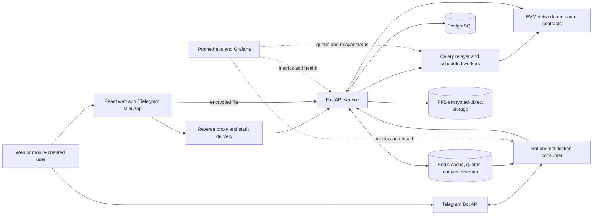

# DFSP — Decentralized File Sharing Platform

> Portfolio framing: previous work by an Oferli technical team member for a **Confidential Client**. This case study does not claim that Oferli originally built the project.

## Project Summary

**Project type:** Privacy-focused file sharing / decentralized storage / Web3 application
**Platforms:** Web application, REST API, Telegram Mini App, Telegram bot, background workers, and EVM smart contracts
**Main technologies:** React, TypeScript, FastAPI, Python, PostgreSQL, Redis, Celery, IPFS, Solidity, Web3.py, Docker, Prometheus, and Grafana

DFSP is a multi-surface file-sharing platform whose primary web workflow encrypts files in the browser, stores ciphertext on IPFS, and records file metadata and access grants through EVM smart contracts. It combines recipient-based sharing, controlled public links, file-integrity verification, key backup and recovery, gas-sponsored transactions, and Telegram access and notifications.

Mikhail, now an Oferli technical team member, implemented the project backend, the application’s blockchain interaction layer, and its infrastructure, and contributed to selected Telegram bot functionality. The project was collaborative and predates Oferli.

# Portfolio Case Study

## Project Overview

- **Project type:** Multi-user encrypted file-sharing platform
- **Domain:** Privacy-focused file sharing, decentralized storage, and Web3
- **Platform:** React web application, FastAPI API, Telegram Mini App, Telegram bot, asynchronous workers, and Solidity contracts
- **Mobile:** No native iOS or Android code is present. Mobile-oriented access is provided through the responsive web interface and Telegram Mini App.
- **Client:** Confidential Client
- **Developer role:** Backend, blockchain integration, and infrastructure engineer, with an additional contribution to selected Telegram bot functionality

## The Problem

The software appears designed for teams that need to exchange sensitive files while reducing the amount of trust placed in a central file server. A conventional service can see file contents and usually controls the only record of ownership and access; DFSP instead moves encryption into the browser, stores encrypted objects by content identifier, and keeps independently verifiable file and grant metadata.

The product also addresses practical usability problems that often make decentralized applications difficult to use: wallet-based authentication, network switching, transaction fees, access-key delivery, revocation, download limits, and cross-device recovery.

The original client brief is not publicly disclosed. This section describes an inference from implemented, repository-verified behavior and does not claim undocumented client requirements.

## The Solution

The repository implements a complete multi-service application around an encrypted file lifecycle:

1. The web client computes identifiers and checksums from the local plaintext, encrypts the file in chunks with AES-GCM, and uploads the encrypted result.
2. The API stores the encrypted object through IPFS, persists searchable application state in PostgreSQL, and records file metadata through an EVM file-registry contract.
3. When a file is shared with a registered recipient, the browser encrypts the file’s symmetric key with that recipient’s RSA public key. The platform creates a capability grant with an expiry time, download allowance, revocation state, and deterministic capability ID.
4. Users sign EIP-712 requests while a background relayer submits the associated EVM transactions. This removes the need for each user to fund transaction fees while preserving signed user intent.
5. A recipient retrieves the wrapped key, decrypts it locally, downloads the ciphertext from IPFS, and decrypts the file in the browser.
6. Owners can also create tokenized public links with expiry, optional download limits, and optional proof-of-work. The decryption key is carried in the URL fragment, which browsers do not send to the server as part of the HTTP request.
7. Telegram account linking, a Telegram Mini App, bot commands, and event-driven notifications extend selected workflows beyond the main web application.

The code also includes file verification against stored/on-chain metadata, version history, soft deletion, grant revocation, local key backup and restore, quotas, health checks, metrics, and containerized deployment.

## Main Features

- Browser-side, chunked AES-GCM file encryption using Web Crypto and Web Workers.
- SHA-256 file identifiers and Keccak-256 integrity checks calculated before encryption.
- Encrypted-object storage through IPFS with content identifiers recorded in application and contract metadata.
- EIP-712 registration/login and signing through a password-protected local EVM key, MetaMask, or WalletConnect.
- TON Connect authentication with explicit restrictions for TON-only accounts that cannot perform EVM contract actions.
- JWT-backed API sessions and verified Telegram WebApp `initData` sessions.
- Per-recipient RSA-OAEP wrapping of file keys using published recipient public keys.
- Capability grants with recipient, expiry, maximum-download, usage, status, and revocation fields.
- Gas-sponsored ERC-2771 meta-transactions handled by asynchronous relayer queues.
- Received/granted access views, status filtering, download flow, and owner-driven revocation in the web app.
- Public links with expiry, optional download limits, optional proof-of-work, revocation, and browser-side decryption.
- File listing, metadata details, renaming, soft deletion, version history, and grant inspection.
- Local-file checksum comparison against registered metadata for integrity verification.
- Password-encrypted key backup, RSA-only backup, legacy key migration, and restore flows.
- Telegram linking and unlinking, multiple linked wallet addresses with one active address, file listing, verification, and one-time download links.
- Telegram notifications with preference controls, quiet hours, deduplication, coalescing, daily limits, and retry handling.
- API health/readiness endpoints, structured request telemetry, Prometheus metrics, Grafana dashboards, and alert rules.
- API, bot, frontend cryptography, and smart-contract tests, including negative paths and contract race behavior.

Not represented as complete:

- The Telegram Mini App’s grants screen is explicitly a placeholder awaiting API integration.
- No native mobile application is present.
- Periodic Merkle roots are computed and stored, but the scheduled worker explicitly leaves submission to the anchoring contract as future work.

## Technical Architecture

The browser is the cryptographic boundary for the primary web workflow: plaintext and file keys are processed locally, while the server receives encrypted file bytes, wrapped recipient keys, and metadata. The FastAPI service coordinates PostgreSQL, Redis, IPFS, and an EVM network. Redis supports caching, challenges, quotas, idempotency markers, Celery task transport, and notification streams. Celery workers relay signed transactions and calculate periodic audit Merkle roots. The Telegram bot consumes notification events and calls the same backend used by the web and Mini App clients.

Container definitions assemble the API, database, cache/queue, encrypted-object storage, EVM node and contracts, workers, Telegram bot, reverse proxy, observability services, and an optional blockchain explorer. GitHub Actions provide component checks, security-oriented scans, commit-convention enforcement, and tagged release artifact generation.

This diagram intentionally omits hostnames, ports, account identifiers, contract addresses, and deployment-specific routing.

## Tech Stack

### Frontend

- React 18 and TypeScript
- Vite and React Router
- Axios
- Web Crypto API, Web Workers, IndexedDB, and browser storage
- ethers.js
- Radix UI / shadcn-derived components and Tailwind-generated styles
- Vitest and happy-dom

### Mobile

- Telegram Mini App implemented in React
- Responsive web interface
- No native mobile project found

### Backend

- Python 3.11
- FastAPI and Uvicorn
- Pydantic Settings
- SQLAlchemy 2 and Alembic
- Web3.py and eth-account
- Celery
- structlog and Prometheus client

### Database

- PostgreSQL
- Redis for cache, quotas, challenges, idempotency, queue transport, and streams

### Infrastructure

- Docker and Docker Compose
- Caddy and Nginx reverse-proxy/static-delivery configurations
- IPFS
- EVM node and Solidity contract deployment tooling
- Optional blockchain explorer services in the deployment definitions

### CI/CD

- GitHub Actions
- Dependabot
- Conventional Commit and pull-request title guards
- Tagged release workflow for frontend and contract artifacts
- TruffleHog secret scanning and dependency-audit jobs

### Testing

- pytest, pytest-asyncio, and HTTPX-based backend tests
- pytest-based Telegram bot tests
- Vitest and happy-dom frontend tests
- Hardhat contract and meta-transaction tests

### Monitoring

- Prometheus metrics
- Grafana dashboards
- Alert rules for queue depth, error rate, and latency
- Structured request logs with trace IDs
- Health, liveness, and readiness endpoints

### Integrations

- IPFS
- EVM smart contracts and ERC-2771 forwarding
- MetaMask
- WalletConnect
- TON Connect
- Telegram Bot API and Telegram Web Apps
- Redis Streams; an optional RabbitMQ notification-consumer adapter is present in code but is not part of the provided Compose stack

### Other

- Solidity and OpenZeppelin contracts
- Hardhat
- OpenAPI documentation and Postman collections
- `uv`, pnpm, and npm lockfiles

## Technical Highlights

### 1. Encryption before upload

The primary upload path computes identifiers locally, encrypts the file in fixed-size AES-GCM chunks, and performs the work in a Web Worker. This keeps plaintext out of the normal upload request and prevents large cryptographic operations from blocking the interface.

### 2. Per-recipient key delivery

Each file has a symmetric key. During sharing, the browser fetches each recipient’s public key and wraps the file key with RSA-OAEP, so the same ciphertext can be shared without re-encrypting the full file for every recipient.

### 3. Gas-sponsored, signed contract actions

The ERC-2771 flow separates user authorization from transaction submission. Users sign typed data, while a Celery relayer uses idempotency records, per-signer Redis locking, prioritized queues, retries, receipt parsing, and database reconciliation to submit and track contract actions.

### 4. Capability-based access lifecycle

The access-control contract and database model use deterministic capability IDs with expiry, maximum downloads, usage, and revocation state. Contract tests cover forwarded and direct calls, deterministic ID agreement, invalid recipients, revocation, and a same-block `useOnce` race.

### 5. Public links without server-delivered decryption keys

Public links can enforce expiry, download limits, revocation, and proof-of-work. The browser adds the file key to the URL fragment and decrypts downloaded ciphertext locally; the fragment is not included in normal HTTP requests to the server. Anyone who obtains the complete link can decrypt the file, so link handling remains security-sensitive.

### 6. Multi-channel identity and access

The system supports local EVM signing, MetaMask, WalletConnect, TON authentication, verified Telegram Mini App sessions, and Telegram-to-wallet linking. The code explicitly prevents TON-only accounts from attempting EVM operations they cannot authorize.

### 7. Event-driven Telegram notifications

Backend events are published idempotently to a stream. The bot consumer supports Redis Streams or an optional RabbitMQ adapter, then applies user preferences, quiet hours, deduplication, coalescing, daily limits, and delivery retries. Download notifications can generate short-lived, one-time links.

### 8. Operational visibility and defensive controls

The API exposes request, latency, relayer, grant, user, proof-of-work, and quota metrics. The repository also contains security headers, validation, rate-limit mechanisms, cache invalidation, dependency audits, secret scanning, dashboards, and alerts. These are implemented controls, not a claim of formal security certification.

## Engineering Decisions

### Client-side encryption with local key custody

- **Decision:** Encrypt files and manage private encryption material in the browser.
- **Likely reason:** Reduce server access to plaintext and support end-to-end encrypted sharing.
- **Trade-off:** Recovery and cross-device use become more difficult. The project compensates with encrypted backups and migration paths, but users remain responsible for protecting backup passwords and complete public links.

### IPFS for objects, PostgreSQL for application state, and EVM contracts for verifiable records

- **Decision:** Split ciphertext storage, searchable operational state, and independently verifiable metadata across three systems.
- **Likely reason:** Each system is used for the job it handles best: content addressing, application queries, and signed state transitions.
- **Trade-off:** The application must reconcile partial failure and temporary disagreement across IPFS, the database, and the chain.

### ERC-2771 meta-transactions

- **Decision:** Have users sign typed requests while an application relayer pays for and submits transactions.
- **Likely reason:** Remove the need for users to hold gas while retaining cryptographic authorization.
- **Trade-off:** The relayer becomes an operational dependency requiring private-key protection, queue ordering, retry behavior, quotas, and monitoring.

### Off-chain mirrors and short-lived caches for grant state

- **Decision:** Keep grant records in PostgreSQL and cache positive download checks in Redis while also consulting contract state.
- **Likely reason:** Avoid a chain call for every view and improve response time.
- **Trade-off:** Cached and database state can become stale. Receipt processing, cache invalidation, and fallback reconciliation are required, and limit enforcement should be reviewed under concurrent downloads.

### Reuse Redis across several operational concerns

- **Decision:** Use Redis for cache, rate-limit counters, proof-of-work challenges, quotas, idempotency, Celery transport, and notification streams.
- **Likely reason:** Reduce the number of infrastructure components in a containerized deployment.
- **Trade-off:** One service becomes a broad operational dependency, and fail-open behavior in several defensive paths needs deliberate production policy.

### Containerized, single-environment stack

- **Decision:** Provide Compose definitions for the complete platform, including persistence, workers, proxying, observability, and chain tooling.
- **Likely reason:** Make a complex system reproducible on a modest deployment footprint.
- **Trade-off:** Compose is straightforward to operate but offers less built-in isolation and horizontal orchestration than a managed or clustered platform. **Reason should be confirmed with the original developer.**

## Challenges

### Confirmed from repository

- Keeping PostgreSQL grant state, Redis caches, and EVM receipts synchronized after asynchronous meta-transactions.
- Serializing signer transactions and retrying relay failures without duplicating completed requests.
- Preventing a second limited-use contract call from succeeding in the same block after the allowance is exhausted.
- Encrypting and decrypting larger files without freezing the browser UI.
- Managing locally stored signing/encryption keys, password-encrypted backup files, and legacy RSA key migration.
- Supporting local signing, browser wallets, WalletConnect, TON Connect, Telegram sessions, and network switching without conflating their capabilities.
- Providing controlled public downloads without accounts while still supporting expiry, revocation, optional proof-of-work, and download counters.
- Delivering event notifications without duplicates or spam and generating one-time download links for Telegram.
- Handling file-ID collisions across different owners without allowing one user to overwrite another user’s record.

### Likely / needs confirmation

- Production reliability of the IPFS node and private EVM network.
- Expected concurrent usage and whether the single-host deployment model met the required scale.
- Required compliance, retention, or data-residency constraints.
- Whether download limits were tested under high concurrency beyond the contract race test.
- Whether a formal security review, penetration test, or independent smart-contract audit occurred.
- Whether on-chain submission of periodic Merkle roots was completed in another branch or deployment; it is not complete in the reviewed worker.
- Whether the application was deployed to production and operated for real users.

## Developer Contribution

Mikhail, now an Oferli technical team member, confirmed responsibility for the following areas:

- **Backend:** The complete backend implementation, including the FastAPI service, application data flows, asynchronous processing, authentication support, file and grant APIs, and operational endpoints.
- **Blockchain interaction:** The application layer connecting users and backend services to EVM contracts, including signed requests, transaction relaying, receipt processing, state reconciliation, and related reliability controls.
- **Infrastructure:** Containerized environments, deployment automation, CI/CD, monitoring, and supporting operational tooling visible in the repository.
- **Telegram:** Selected bot functionality. This case study deliberately keeps the bot contribution secondary and does not attribute the complete bot to Mikhail.

The project was collaborative. The complete frontend and complete Telegram bot are not attributed to Mikhail, and this case study does not claim that Oferli originally built the product.

## Outcome

### Technical outcome

The completed repository enables a user to register or sign in with supported signing methods, encrypt and upload a file, record verifiable metadata, share decryption access with registered recipients, create and revoke controlled public links, view and revoke grants, download and decrypt authorized files, compare a local file with registered checksums, back up local keys, and use selected workflows through Telegram.

It also provides the surrounding services required to operate the application: asynchronous transaction relaying, database migrations, Redis-backed controls and notifications, health checks, metrics, dashboards, alerts, deployment definitions, and automated component checks.

The periodic audit pipeline currently computes and stores Merkle roots but does not prove completed on-chain submission from the scheduled worker.

### Business outcome

Not disclosed. No user counts, deployment scale, revenue impact, adoption figures, time savings, incident reduction, or other business metrics are claimed.

## GitHub Portfolio Card

**Project:** DFSP — Decentralized File Sharing Platform
**Category:** Encrypted file sharing / Web3 / Telegram-enabled web platform
**Stack:** React, TypeScript, FastAPI, PostgreSQL, Redis, Celery, IPFS, Solidity, EVM, Telegram, Docker
**Built:** A multi-surface platform for browser-encrypted uploads, verifiable file metadata, controlled recipient and public-link sharing, and gas-sponsored contract actions.
**Key value:** Demonstrates end-to-end delivery across browser cryptography, APIs, asynchronous processing, smart contracts, infrastructure, and observability.
**Case Study:** [Oferli-Team/dfsp-case-study](https://github.com/Oferli-Team/dfsp-case-study)
