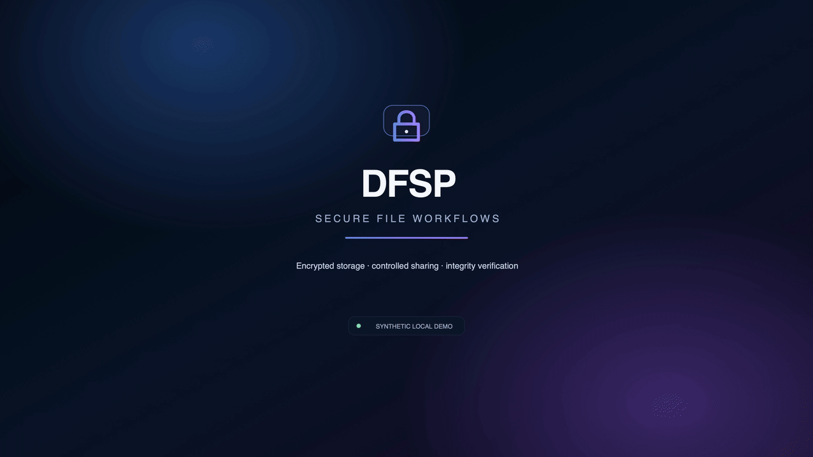
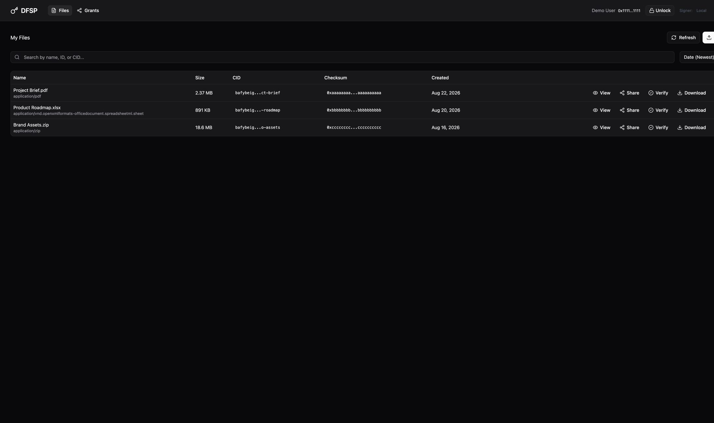
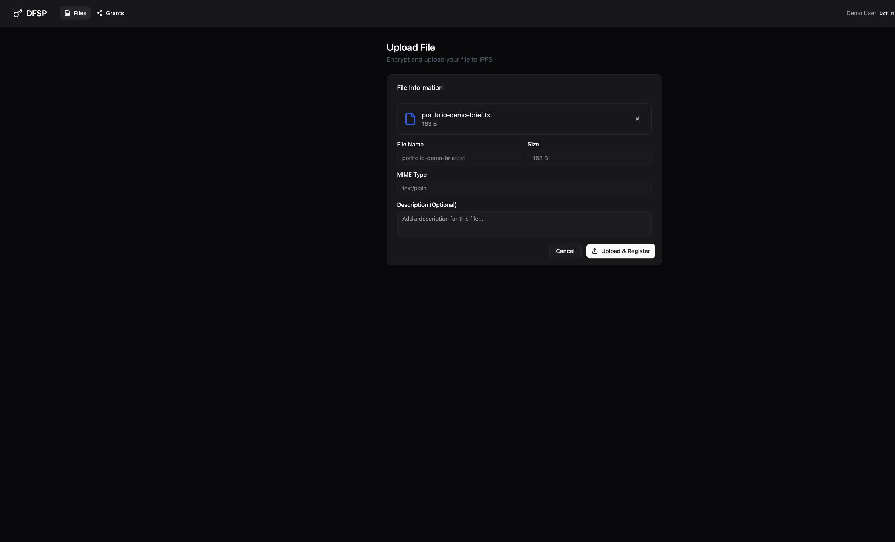
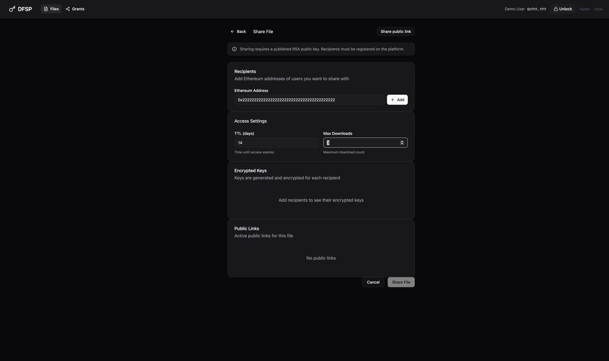
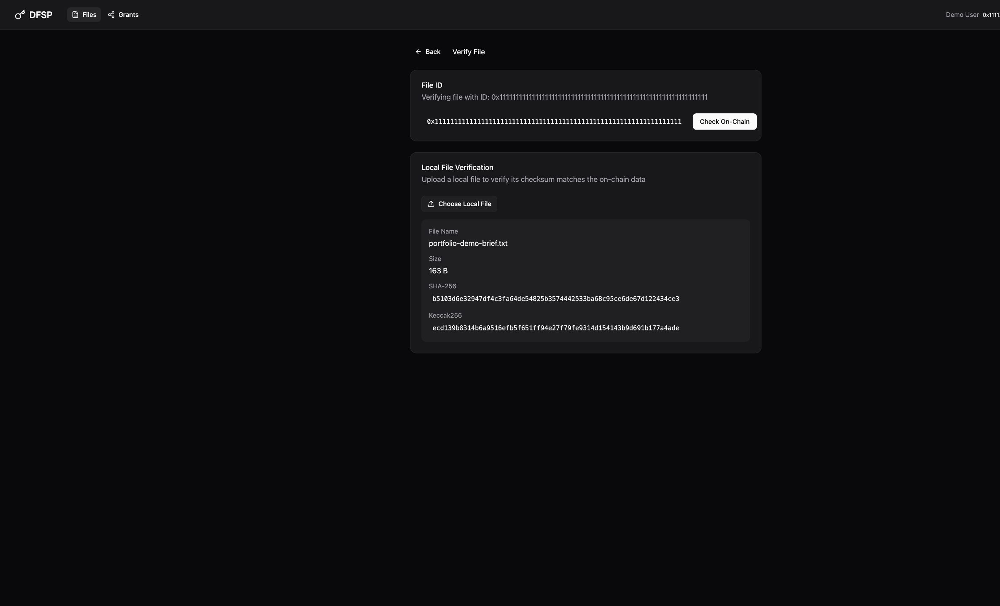
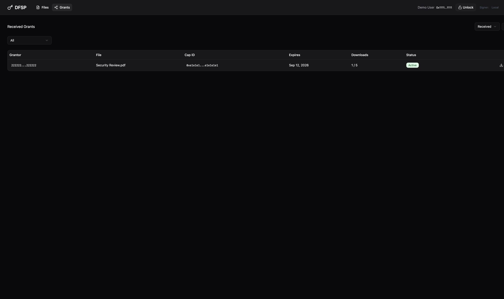
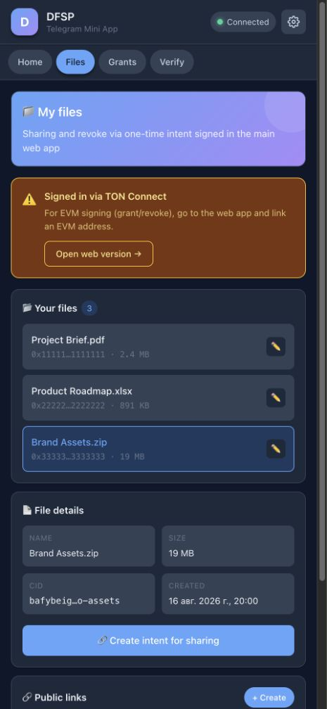
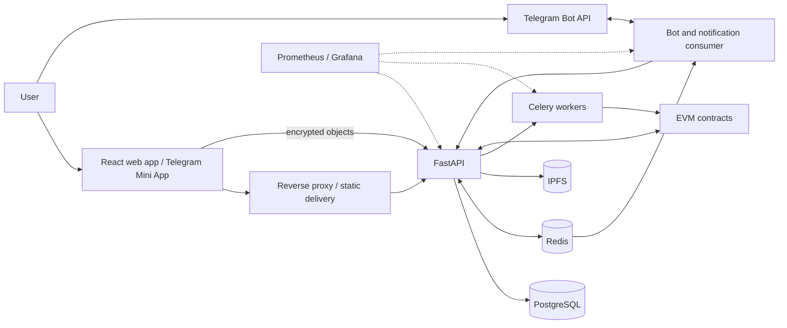

# DFSP — Decentralized File Sharing Platform

> Previous work by an Oferli technical team member for a **Confidential Client**. This portfolio entry does not claim that Oferli originally built the project.

DFSP is a privacy-focused file-sharing platform whose primary web workflow encrypts files in the browser, stores ciphertext through IPFS, and records file metadata and access grants using EVM smart contracts. The product includes controlled recipient sharing, revocable public links, file verification, gas-sponsored contract actions, key recovery, and Telegram access and notifications.

**Stack:** React, TypeScript, FastAPI, Python, PostgreSQL, Redis, Celery, IPFS, Solidity, Docker, Prometheus, Grafana, and Telegram.

## Screenshots and Demo

### Encrypted file workflow

### Controlled sharing and verification

### Telegram Mini App

All published captures use an isolated local environment and synthetic accounts, addresses, file names, file IDs, and checksums. No client, customer, production, credential, or live-infrastructure data is shown.

## Overview

- **Category:** Encrypted file sharing / decentralized storage / Web3
- **Platforms:** Web application, REST API, Telegram Mini App, Telegram bot, workers, and EVM smart contracts
- **Client:** Confidential Client
- **Mobile:** Responsive web and Telegram Mini App; no native iOS or Android code
- **Contribution:** Mikhail, now an Oferli technical team member, implemented the backend, the application’s blockchain interaction layer, and the project infrastructure, and contributed to selected Telegram bot functionality.

## The Problem

The application appears designed for teams that need to exchange sensitive files without sending plaintext through the normal storage workflow or relying on a single database as the only record of file integrity and access. It also addresses practical usability work around decentralized applications: authentication, transaction fees, network selection, decryption-key delivery, revocation, download allowances, and key recovery.

The original client brief is not publicly disclosed. This problem statement is an inference from implemented, repository-verified behavior rather than a claim about undocumented client requirements.

## The Solution

The browser calculates file identifiers and integrity checks, encrypts the file in chunks with AES-GCM, and uploads the encrypted result. The backend coordinates IPFS, PostgreSQL, Redis, and EVM contracts; recipient file keys are wrapped with RSA-OAEP; and users sign EIP-712 requests that an asynchronous relayer submits on their behalf.

Owners can share with registered recipients or create public links with expiry, optional download limits, optional proof-of-work, and revocation. Recipients download ciphertext and decrypt it locally. Telegram linking, a Mini App, and a notification consumer expose selected account, file, verification, and download workflows outside the main web interface.

## Main Features

- Browser-side chunked AES-GCM file encryption
- IPFS encrypted-object storage and EVM file metadata
- Local EVM signer, MetaMask, WalletConnect, and TON authentication paths
- Per-recipient RSA-OAEP key wrapping
- Expiring, revocable grants with download allowances and usage state
- ERC-2771 gas-sponsored meta-transactions
- File list, details, versions, renaming, soft deletion, and grant views
- Public links with expiry, optional limits, proof-of-work, and local decryption
- Local-file checksum verification against registered metadata
- Password-encrypted key backup, restore, and legacy migration
- Telegram linking, multiple linked addresses, file listing, verification, one-time links, and notifications
- Health checks, metrics, dashboards, alerts, and containerized deployment

The repository does **not** show a native mobile app. The Mini App grants page is a placeholder, and the scheduled Merkle worker computes/stores roots but leaves contract submission as future work.

## Architecture

## Tech Stack

| Area | Technologies found in the repository |
|---|---|
| Frontend | React, TypeScript, Vite, React Router, Axios, ethers.js, Web Crypto, Web Workers, IndexedDB, Radix UI/shadcn-derived UI, Tailwind-generated CSS |
| Mobile | Telegram Mini App and responsive web; no native mobile code |
| Backend | FastAPI, Python, Pydantic, SQLAlchemy, Alembic, Web3.py, Celery |
| Data | PostgreSQL, Redis |
| Storage and chain | IPFS, Solidity, OpenZeppelin, ERC-2771, Hardhat, EVM node tooling |
| Infrastructure | Docker Compose, Caddy, Nginx |
| CI/CD | GitHub Actions, Dependabot, commit/PR convention checks, tagged artifact releases, dependency audits, TruffleHog |
| Testing | pytest, pytest-asyncio, HTTPX, Vitest, happy-dom, Hardhat |
| Monitoring | Prometheus, Grafana, structured logging, health/liveness/readiness endpoints |
| Integrations | MetaMask, WalletConnect, TON Connect, Telegram Bot API, Telegram Web Apps |

## Technical Highlights

- **Cryptographic boundary in the browser:** plaintext checksumming, chunked encryption, recipient key wrapping, and decryption are implemented client-side for the primary web flow.
- **Gas-sponsored signed actions:** EIP-712/ERC-2771 requests pass through prioritized Celery queues with per-signer locks, retries, idempotency, receipt parsing, and state reconciliation.
- **Capability-based sharing:** deterministic capability IDs connect expiry, maximum downloads, usage, and revocation across database and contract state.
- **Controlled public links:** the server manages link policy while the decryption key remains in the URL fragment and is used by the browser.
- **Multi-channel delivery:** the same backend supports the main web app, Telegram Mini App sessions, bot commands, and event-driven notifications.
- **Operational visibility:** the repository includes metrics, dashboards, alerts, health checks, security headers, quotas, and rate-limit mechanisms.

## Contribution

Mikhail, now an Oferli technical team member, confirmed responsibility for:

- The complete backend implementation
- The application’s blockchain interaction layer, including signed actions, transaction relaying, receipt tracking, and contract integration
- Infrastructure, containerized deployment, CI/CD, monitoring, and operational tooling
- Selected Telegram bot functionality

The project was collaborative. This case study does not attribute the complete frontend or the complete Telegram bot to Mikhail, and it does not claim that Oferli originally built the product.

## Outcome

### Technical outcome

The repository delivers an integrated encrypted-file workflow from browser encryption and IPFS storage through access grants, local decryption, verification, Telegram access, asynchronous processing, and observability.

### Business outcome

Not disclosed. No user counts, production-scale figures, revenue impact, or other business metrics are claimed.

## Video Walkthrough

[Watch the 29-second high-resolution dark product walkthrough](visuals/dark-4k/dfsp-dark-walkthrough-4k.mp4)

[Watch the GitHub-friendly version](visuals/dark-4k/dfsp-dark-walkthrough-1080p.mp4)

[See the safe code-walkthrough outline](VIDEO_WALKTHROUGH.md)

The walkthrough should use a local or isolated demo environment with synthetic data and should not show environment files, logs, deployment targets, real accounts, real links, or live monitoring.

## Confidentiality Notice

This repository is a portfolio case study about previous work by an Oferli technical team member. It intentionally excludes proprietary source code, setup instructions, credentials, private endpoints, client identity, customer data, and live infrastructure details. Product visuals use an isolated local environment with synthetic data.

For the complete technical analysis, see [CASE_STUDY.md](CASE_STUDY.md). For a concise client-facing version, see [SALES_SUMMARY.md](SALES_SUMMARY.md).
